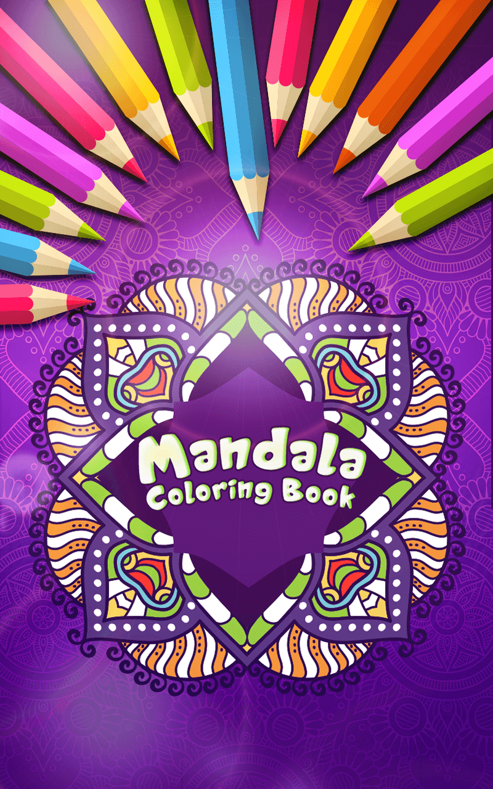
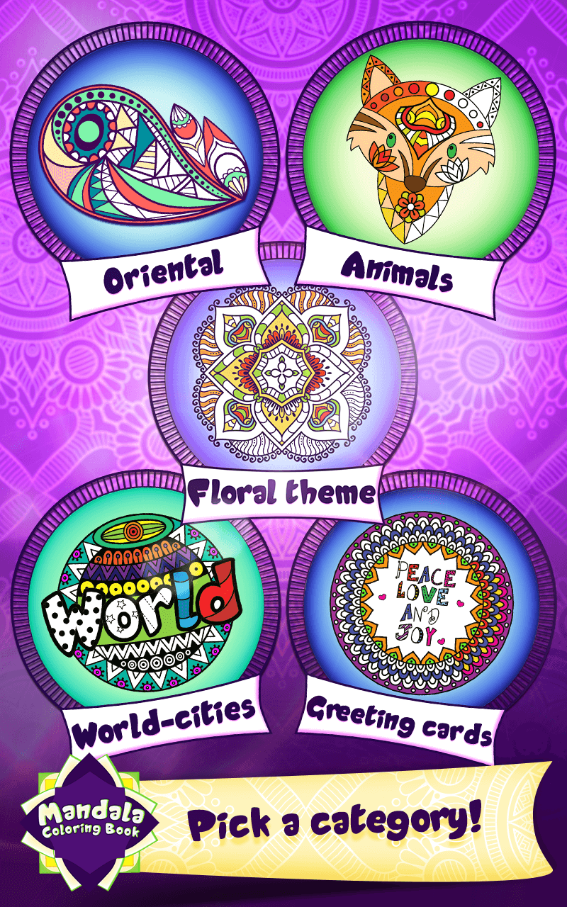
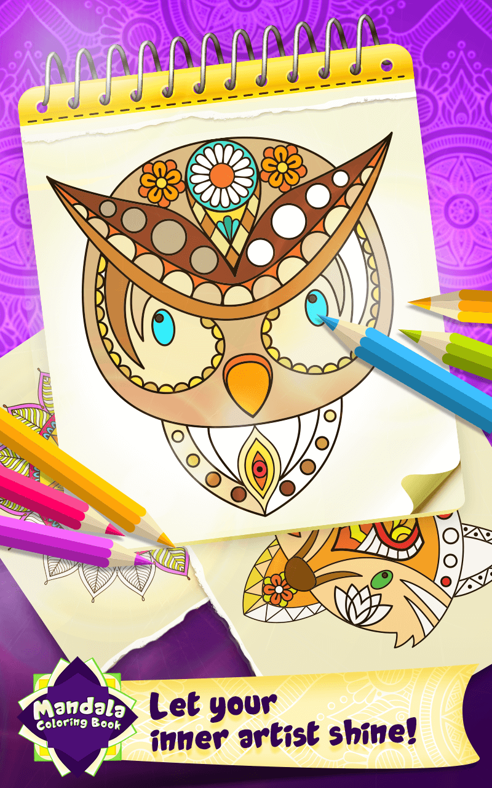
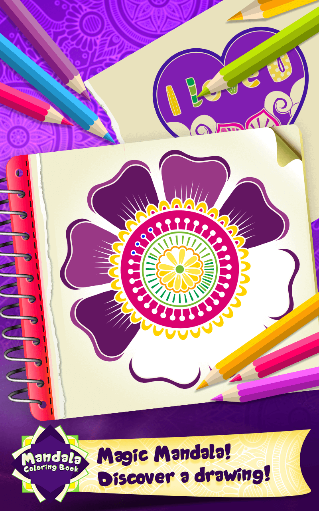
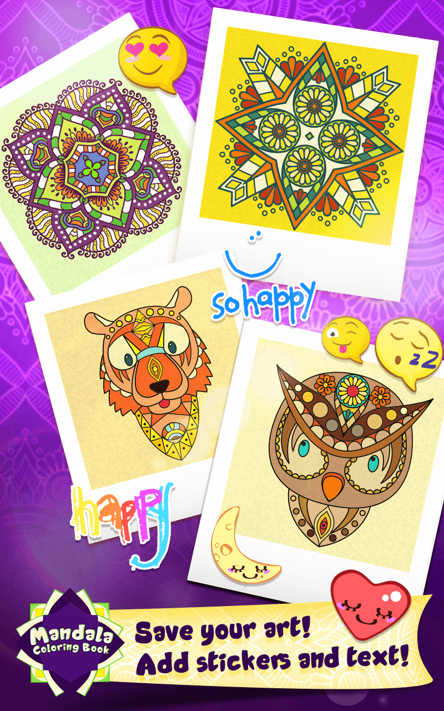

# Coloring-Book

  
  
  
  
  

## Features
  * 3 different game modes (Default, Magic, Blank)
  * Paint Engine with different brushes and Undo support
  * Pinch to zoom
  * 50 mandala drawings in 5 different categories
  * 12 editable color palettes with 10 shades a peace
  * 65 stickers
  * Rate integrated

## [DOCUMENTTION](https://github.com/abhisheknaiidu/abhisheknaiidu)
